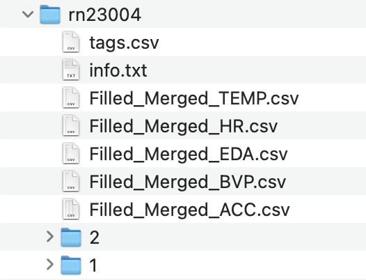
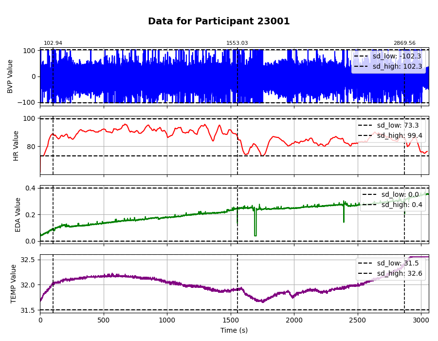

Reut Naim Pre-Processing Pipeline
=============================
Pre-processing pipeline for physiological signal data.
Filtering outliers, handling missing data, tagging, and visualization data collected using Empatica watches.

## How it Works

1. Participants that have missing data points are handled so that the missing data is filled in with the mean of the existing data.
2. Individual temperature, BVP, heart rate, acceleration, and EDA participant data are filtered to exclude data that exceed 2.5 standard deviations of each participant's individual mean. Participants that exceed 2.5 standard deviations in more than 10% of their collected data points are excluded from analysis.
3. Tags corresponding to the time when a participant was presented with a cognitive challenge are associated with each participant's data.
4. New files with the filtered and tagged data are saved into a new "cleaned" directory
5. The filtered data can be visualized individually for each participant on a plot including the tag values and the 2.5 standard deviation values.

## Usage
--SAMPLE CODE THAT SHOWS HOW TO USE THE LIBRARY--

images that show how to run code. 
1. what new folders/files look like for missing data folders

2. what new clean directory looks like

3. image of visualization

## Contributing
Contributions are welcome! Please follow these steps:
1. Fork the repository.
2. Create a new branch (`git checkout -b feature-branch`).
3. Make your changes.
4. Commit your changes (`git commit -m 'Add some feature'`).
5. Push to the branch (`git push origin feature-branch`).
6. Open a pull request.

## Contact

- Denise Jaeschke - denisecjaeschke@gmail.com
- Nour Safadi - noursafadi99@gmail.com
- Freya Prein - fr.prein@gmail.com
- Sofia Karageorgiou - karageorgiou@mail.tau.ac.il
- Shiri Arnon - shiri.arnon@gmail.com

Project Link: https://github.com/freyaprein/reutnaim_hackathon2024

* Free software: MIT license
* Documentation: https://reut-naim-hackathon-project-2.readthedocs.io.

Credits
-------

This package was created with Cookiecutter_ and the `audreyr/cookiecutter-pypackage`_ project template.

.. _Cookiecutter: https://github.com/audreyr/cookiecutter
.. _`audreyr/cookiecutter-pypackage`: https://github.com/audreyr/cookiecutter-pypackage
